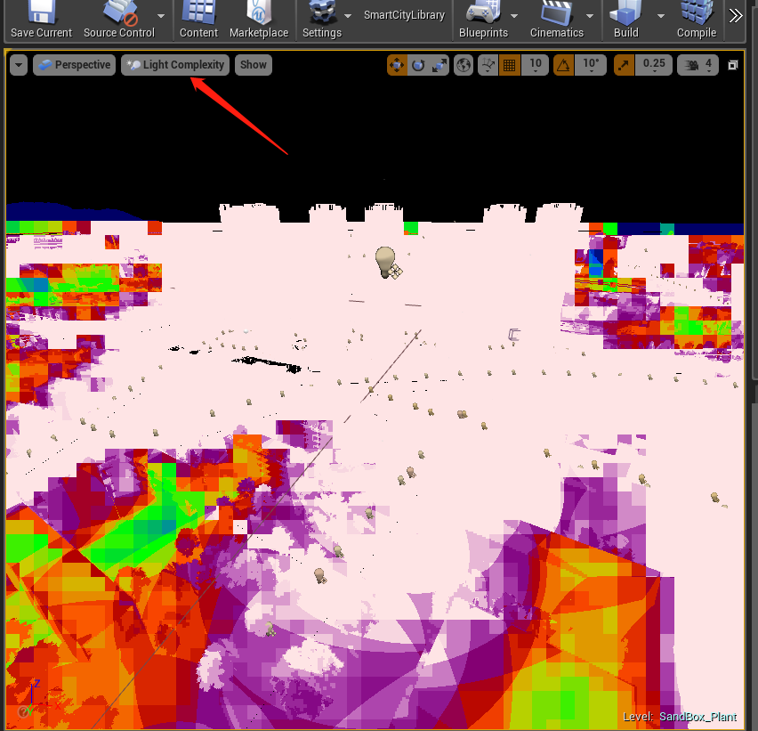

## 引擎优化三板斧

### 两个大前提

A、对于3D+或者智慧城市的项目，drawcall > 9000，强烈建议要在Project Setting开启Distance Field Shadow，配合下面的第三点，大大节约GPU的开销。
对于Allow Static Lighting，这个也可以关闭，通常用于bake光照用的。地图里完全没有静态光照的时候，关闭也可以提高性能。

B、然后关闭Early Z-pass和DBuffer Decals，这两个功能同时关掉才能关闭PrePass，PrePass这个功能是主要用来做遮挡剔除的，当遮挡剔除不能剔除掉一半以上的模型时，开遮挡剔除是消耗性能的。

3D+或者智慧城市通常几乎没有什么遮挡剔除的机会，所以可以关闭。

关闭DBuffer Decals有个后遗症是，level里用的decal会变成类似自发光的材质，不受灯光和阴影影响。如果一定要用decal这个功能要慎重处理。

重要提示：

对于目前L1智慧城市，或者类似园博园这样植物很多，而且以漫游为主的项目而言，可以不关闭Early Z-pass，甚至可以使用很长的动态阴影。
因为这样的项目drawcall本来就不多，而且点数也不会很多，开启Early Z-pass，可以有效的剔除像素，降低像素填充率，从而降低base pass，提高效率。

整个场景drawcall < 6000时，建议可以不关闭上面说的两点。

### 粗略判断性能瓶颈来源

用tab上的~键，打开控制台，输入stat unit，可以看到下图，这个是优化性能的第一步，通过这个，我们可以初步判断出是CPU还是GPU的问题

下图是两种情况：

第一张图Game=14.46小于Draw=23.61，说明压力在GPU上
这种情况下，可以使用stat gpu和stat rhi观察瓶颈具体在GPU的哪个环节，也可以用Ctrl+Shift+逗号，可以看到更加具体的数据

第二张图Game=14.40大于Draw=11.54，说明压力在CPU上，原理是CPU向GPU传送数据，GPU其实大部分时间是在等待CPU数据过来，GPU是空闲的，所以会显得GPU和CPU所消耗的时间相同。
这种情况下，可以使用stat cpu，stat Character，stat tickables，有时候也会使用stat ai，观察哪部分消耗比较大

   

#### 1、用统计窗口可以很直观的看到模型、贴图的使用情况

 

#### 2、合并相同物体的actor。如果一个模型在场景里复用了很多次，那么可以用merge actor功能将这些模型合并成一个Hierarchical Instanced StaticMesh

见下图。

默认引擎并不提供这个功能，如需要，需要更新DA_DEV分支下的一个更新，见下图

总体来说，只要是引用了相当数量的相同模型的actor，不管是在场景里，还是BP里，都要使用instance来减少drawcall。至于是使用普通的instance还是使用Hierarchical Instance，取决于actor在场景里的分布，如果相对集中，那么可以使用前者，分散的很开的话，则一定要使用Hierarchical Instance

#### 3、主光源的动态阴影不宜太长，十分消耗GPU性能，而且会显著增加draw call，可以用Distance Field Shadow来补。

A指的是DF Shadow作用的最大范围，从C设置的距离开始作用，意思是如果按照下图的设置，DF Shadow作用的距离是40000（400米）- 500000（5000米）之间

B指的是DF阴影追踪的范围在哪里，这个和场景里光源角度有关。可以看第二张图。直角三角形的斜边就是C设置的距离，如果不够长，阴影就会变短。

C就是大家熟悉的动态阴影的作用范围，0-40000（400米），默认是20米。如果甲方不在意的话，建议直接设为0，关闭动态阴影，但是无论如何不能太长。

 

注：如果是智慧城市项目，在使用自动生成的地图时，因为每块2公里的tile里的模型是合并在一起的，所以主光源的阴影可以设置的非常长也不会对性能有大的影响，比如把C设置为20km，也就是2000000。

#### 4、大场景可以使用HLOD来大范围减少drawcall，只不过如何来划分HLOD得根据项目实际需求

#### 5、单一的level，尺寸不能超过4km*4km，否则物理在地图边缘会出错。一般可以使用world composition来做超过4公里的大场景。

建议单一level的尺寸在2公里见方，这样在streaming的时候load时间相对短。

#### 6、如果增加了骨骼物体，比如人流，那么需要在spawn这个mesh的时候做优化，可以大大节省CPU性能，见下图

 

#### 7、使用spline功能增加路灯，行道树等模型时，蓝图里不要选择创建static mesh component，而建议增加Hierarchical Instance Static Mesh component或者 Instance Static Mesh component，这两个instance的区别可以参考上面的第二点。这样也可以大量减少drawcall

#### 8、无论如何要保证贴图的2的幂次方，非2的幂次方贴图比2的幂次方贴图，容量大4到7倍。

#### 9、对于植物而言，如果需要刷的植物支持DF的阴影，则需要满足两个条件：

     一是在Mode的Foliage里勾选Affect Distance Field Lighting
     二是在模型里勾选Two-Sided Distance Field Generation，并且点击Apply Changes，让其生效
详细见下图：

 

#### 10、夜景灯光优化时，切记打开Light Complexity，尽量减少白色区域，白色区域造成的主要原因是多盏灯光重叠造成的，所以要尽量减少灯光的影响范围。

蓝绿比较合理，红白面积尽量减少。
下图中的例子，夜晚帧率比白天要低一半。

PS：https://unrealartoptimization.github.io/book/

这个网站里的文章虽然还未完全写完，但是有不少关于优化很好的文章，值得一看
