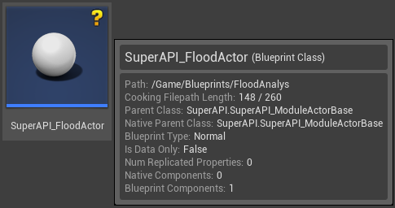
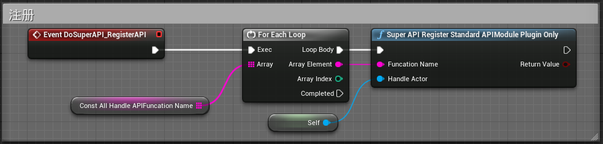
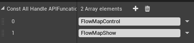
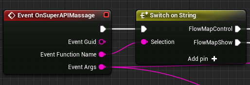

## 如何使用SuperAPI
---

### 1.继承SuperAPIModuleActorBase

新建Blueprint Actor，继承父类SuperAPIModuleActorBase

### 2.复写API注册事件

复写"Event DoSuperAPI_RegisterAPI"事件，在变量自定义的函数名称数组中添加要注册的函数名，之后调用"SuperAPIRegisterStandardAPIModulePluginOnly"函数进行注册

### 3.复写API消息事件

之后复写"Event OnSuperAPIMessage"事件，在前端调用对应的注册事件时，执行对应的引脚

根据"Event Function Name"确定事件名称，"Event Args"确定前端传入的参数

## 如何对前端回调信息
---
