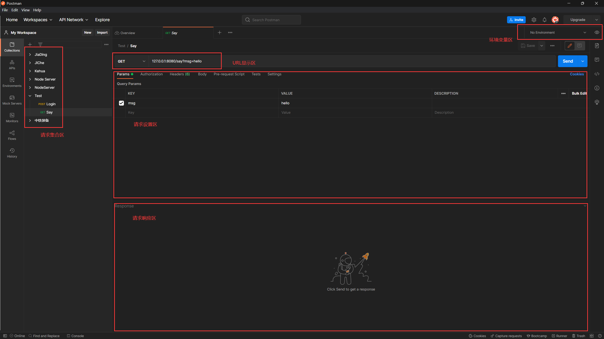

## Http Method详解
---

### 背景

Http Method是客户端与服务端交互的一种请求方式，常用的Method有两种，分别是GET和POST。
在早期网页开发中，前段和后端还没有分离，服务器代码和网页代码糅合在一起，与服务器交互主要是通过html的form表单来进行的，像是这样的：

```html
<form action="/login" method="get"> <!--method="post"-->
    <input id="username" type="text" name="username"> <br>
    <input id="password" type="password" name="password"> <br>
    <input type="submit" value="提交">
</form>
```

这是一个用户登录的表单，通过在“input”标签中输入用户名和密码，然后点击提交之后，表单会发送数据到服务器，然后服务器验证用户名和密码完成登录。点击提交按钮之后我们观察浏览器的URL地址栏，首先是“method=get”时的地址栏：

`http://xxxx/login?username=admin&password=199798`

再看“method=post”时的地址栏：

`http://xxxx/login`

这是“get”与“post”最直观的区别。

### Get与Post

上面我们做了个测试发现了这两种请求方式最只管的区别：

Get会将表单中的数据拼接到url后面，直接通过url明文传输，哪怕输入的是密码！因此Get是不能用于传输敏感数据的。同时url的长度是有限制的，常用的Chrome浏览器最大支持8182个字符的url，也就是说url能承载的数据量是有限的；

Post会将表单中的数据放到自己的Request Body中进行传输，他对用户是不可见的。同时能承载的数据量也比Get更大，甚至能够用于上传文件！

但这并不是说Get完全没有优点，它足够简单，而且比Post更快！

### Postman

后来，网页开发逐渐发展为前后端分离的模式：服务端只负责处理数据，并将处理后的结果传输给前端。Web端只专注于处理显示逻辑和动画、特效等。这样做的好处自然就是各自只专注与自身职责，前端与后端解耦，不再糅杂在一起，调试变得前所未有的方便。另外，后端的接口应用对象不再只局限于Web端，只要是兼容Json的终端都能够应用，因此，一套接口，多端使用的模式它来了！

Postman就是专门针对后端接口的一款专业测试软件，我们可以通过Postman上的结构来进一步分析Get和Post的差异：



我们着重看请求设置区： \
Params：代表与QueryString相关的设置，也就是Get请求的URL参数，\
Headers：代表请求头设置， \
Body：代表请求体设置，也就是Post请求携带数据的地方，

### 拓展-RESTful风格的API

RESTful全称是“Representational State Transfer”，REST本身并没有创造新的技术、组件或服务，而隐藏在RESTful背后的理念就是使用Web的现有特征和能力， 更好地使用现有Web标准中的一些准则和约束。虽然REST本身受Web技术的影响很深， 但是理论上REST架构风格并不是绑定在HTTP上，只不过目前HTTP是唯一与REST相关的实例。 所以我们这里描述的REST也是通过HTTP实现的REST。

一些重要的概念：
- 资源：Resource，表示能够在网络上获取到的一种资源或服务，能用URI表示出来的
- URI：Uniform Resource Identifier，统一资源标志符
- URL：Uniform Resource Location，统一资源位置

#### 举例

```shell
// 表示id为1的书
https://127.0.0.1/books/1

// 表示标题为xxx的书
https://127.0.0.1/books?title=xxx

// 表示标题为xxx的书
https://127.0.0.1/books/title/{title}

// 表示分页查询，第1页，每页包含10条数据
https://127.0.0.1/books?page=1&size=10
```

#### Http Method 也有了语义

RESTful架构应该遵循统一接口原则，统一接口包含了一组受限的预定义的操作，不论什么样的资源，都是通过使用相同的接口进行资源的访问。接口应该使用标准的HTTP方法如GET，PUT和POST，并遵循这些方法的语义。

- GET 表示服务器查询、筛选、获取某一个或符合条件的所有资源，该操作绝对不会对服务器中的数据进行修改
- POST 表示在服务器上新建一个资源
- PUT 表示在服务器上更新一个资源（全量更新）
- PATCH 表示在服务器上更新一个资源（替换更新）
- DELETE 表示在服务器上删除一个资源

#### 状态码

- 200 Ok，操作成功
- 400 Bad Request，坏请求，大概率是参数错误
- 403 Forbidden，没有权限访问
- 404 Not Found，URL地址未找到
- 500 Server Error，服务器错误

#### 无状态&token

对于各资源的请求，都不依赖于其他资源或其它请求，每个资源都是可以寻址的，都有至少一个url能够访问到。

但是正式由于无状态，对于一些铭感的资源需要通过认证和权限来对资源进行限制，因此需要一个token来识别访问者的身份。

token一般会放到请求头中，由服务器后端自行实现认证。
